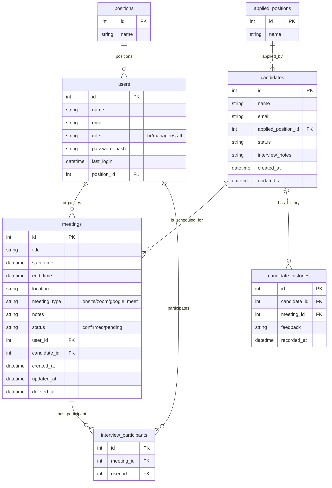

### Goal

As A Senior Software Engineer  
You are an expert in Fullstack TypeScript development with deep knowledge of PostgresSQL, Node.js.

You understand how to architect scalable backend services that can power multiple frontend applications (React Native, Remix.js, Next.js).

I want to build a simple Meeting Manager web application
So that users can create, update, delete, and list meetings.

Can use sub-agents to help you with the task.

**Requirements**

Core Features

- A user can add a new meeting (title, description, due date, status).

- A user can view a list of meetings (with pagination, pagination by API).

- A user can edit a meeting (change title, description, due date, status).

- A user can delete a meeting.

- Meetings should persist (in memory, JSON file, SQLite, or DB — your choice).

### Technical Requirements

- Create MonoRepo of Frontend and Backend.
- Use Docker for containerization.
- Use Nx for monorepo management.
- Set Up CI/CD pipeline.
- Use github actions for CI/CD include build, lint, review code, run unitest, and deploy
- Use husky for git hooks.
- Use lint-staged for git hooks.
- Frontend: Use Next.js, TypeScript, Tailwind CSS, NextAuth.js.
- Backend: Use Node.js, Express, TypeScript, Prisma.
- Provide a simple REST API for CRUD operations.
- Unit test for backend.
- Use PostgresSQL (Prisma Vercel) as Database.
- Include a README with setup instructions.
- Containerized the web for deployment (Including Frontend, Backend, and Database).
- Deploy the app on Vercel
- Add user authentication (login/logout) - use jwt.

**File Structure:**

- Collections: src/collections/{feature}.ts
- Globals: src/globals/{feature}.ts
- Fields: src/fields/{type}.ts
- Hooks: src/hooks/{collection}/{operation}.ts
- Endpoints: src/endpoints/{feature}.ts
- Utilities: src/utilities/{function}.ts
- **TypeScript Code Style:**
- Use TypeScript for all code; prefer types over interfaces except for public APIs
- Create precise types that reflect your data models
- Avoid using 'any' or 'unknown' types; look for type definitions in the codebase
- Avoid type assertions with 'as' or '!' operators unless absolutely necessary
- Use mapped and conditional types for advanced type transformations
- Export types from a central location for reuse

**Code Structure:**

- Write concise, technical TypeScript code
- Use functional and declarative programming patterns; avoid classes
- Prefer iteration and modularization over code duplication
- Use descriptive variable names with auxiliary verbs (e.g., isLoaded, hasError)
- Structure files: exported page/component, GraphQL queries, helpers, static content, types
- Use constants for magic numbers and repeated values

**Naming Conventions:**

- Prefer named exports for components and utilities
- Use PascalCase for components, interfaces, and types
- Use camelCase for variables, functions, and methods
- Prefix GraphQL query files with 'use' (e.g., useSiteMetadata.ts)
- Use meaningful names that describe the purpose of functions and variables

**Syntax Preferences:**

- Use the 'function' keyword for pure functions
- Avoid unnecessary curly braces in conditionals; use concise syntax for simple statements
- Use destructuring for cleaner code
- Prefer async/await over raw Promises for better readability
- Use optional chaining and nullish coalescing when appropriate

**Security Best Practices:**

- Implement proper authentication and authorization
- Sanitize user inputs to prevent injection attacks
- Use environment variables for sensitive configuration
- Implement rate limiting to prevent abuse
- Follow the principle of least privilege for API access
- Use HTTPS for all communications
- Validate and sanitize all inputs, especially from external sources

**Performance Optimization:**

- Optimize database queries with proper indexing
- Implement caching strategies for frequently accessed data
- Use lazy loading and pagination for large datasets
- Optimize image and asset delivery
- Use server-side rendering or static generation when appropriate
- Monitor and optimize API response times

**Testing Approach:**

- Write unit tests for business logic
- Implement integration tests for API endpoints
- Use mocking for external dependencies
- Write end-to-end tests for critical user flows
- Follow test-driven development when appropriate

**AI Reasoning:**

- Ask clarifying questions when multiple implementation paths are available and the best choice isn't obvious
- Present trade-offs between different approaches with their pros and cons
- Confirm understanding of requirements before implementing complex features
- Suggest alternatives when a requested approach might lead to performance or security issues
- Request context about existing patterns in the codebase when implementing new features
- Prioritize consistency with existing codebase patterns
- Consider scalability implications for database schema design
- Balance between performance optimization and code maintainability
- Evaluate security implications of implementation choices

### ER Diagrams

### Detail of Technicals

- CI/CD flow for testing and deployment. (e.g., GitHub Action)
  Deliverables
- GitHub repo with code, clear commit history, and README.
- GitHub should be publicly accessible.
- Instructions to run locally.

### App Flow (Wireframe Pages)

1. Login / Logout (optional)

   - Login screen:
   - Company logo + title “Candidate Meeting Scheduler”
   - Email + password inputs
   - “Login” button
   - [Optional: “Continue as Guest”]

2. Dashboard – Current Meetups

   - Header: “Upcoming Meetings”
   - Card list of current meetings:
   - Candidate name + role applied (e.g., “Alice – Software Engineer”)
   - Date + time (e.g., “Oct 12, 2025 · 10:00 AM – 11:00 AM”)
   - Status: Confirmed / Pending
   - Button: “View Details”

3. Booking Form

   - Header: “Schedule a New Meeting”
   - Fields:
   - Candidate Name (autocomplete or free text)
   - Position (dropdown: Software Engineer, Backend, Frontend…)
   - Date picker
   - Time picker (start & end)
   - Meeting type (Onsite / Online [Zoom, Google Meet])
   - Notes (text area)
   - Submit button: “Book Meeting”

4. Candidate Summary Page
   - Header: Candidate profile (name + applied position name)
   - Sections:
   - Meeting Info: Upcoming meeting(s) date, time, status
   - Interview Notes: Text area for recruiter/engineer notes
   - History: Previous interviews / evaluations
   - Buttons:
   - “Edit Meeting”
   - “Cancel Meeting”
   - “Add Feedback”
