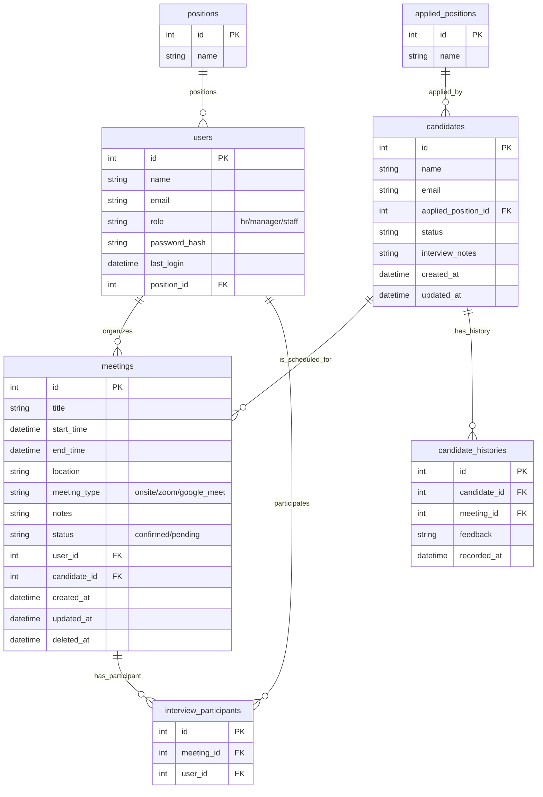

```mermaid
erDiagram

    users ||--o{ meetings : organizes
    candidates ||--o{ meetings : is_scheduled_for
    candidates ||--o{ candidate_histories : has_history
    applied_positions ||--o{ candidates : "applied_by"
    positions ||--o{ users: positions

    meetings ||--o{ interview_participants : has_participant
    users ||--o{ interview_participants : participates

    users {
        int id PK
        string name
        string email
        string role "hr/manager/staff"
        string password_hash
        datetime last_login
        int position_id FK
    }

    positions {
        int id PK
        string name
    }

    interview_participants {
        int id PK
        int meeting_id FK
        int user_id FK
    }

    candidates {
        int id PK
        string name
        string email
        int applied_position_id FK
        string status
        string interview_notes
        datetime created_at
        datetime updated_at
    }

    meetings {
        int id PK
        string title
        datetime start_time
        datetime end_time
        string location
        string meeting_type "onsite/zoom/google_meet"
        string notes
        string status "confirmed/pending"
        int user_id FK
        int candidate_id FK
        datetime created_at
        datetime updated_at
        datetime deleted_at
    }

    applied_positions{
        int id PK
        string name
    }

    candidate_histories {
        int id PK
        int candidate_id FK
        int meeting_id FK
        string feedback
        datetime recorded_at
    }

```
